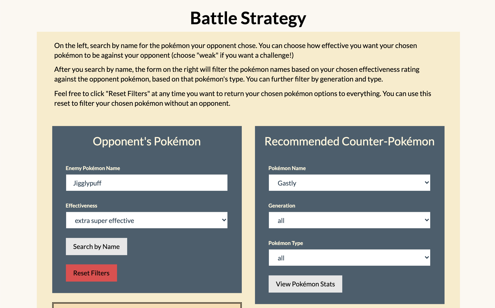
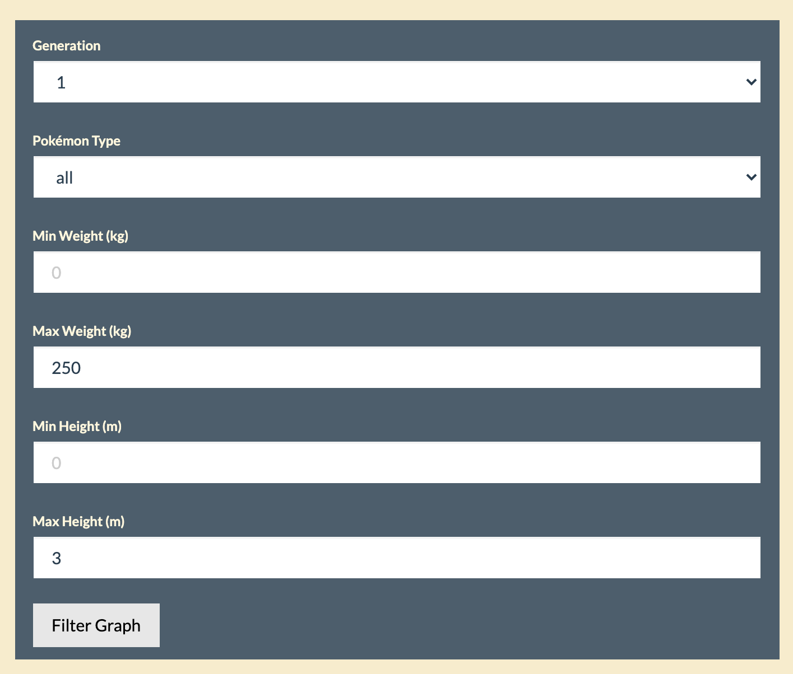

# Pokémon Project
Exploration of pokemon data

For this project, we were required to source some data and create a Flask app web server to serve the data from a database backend to users viewing an interactive website with JavaScript processing the data. We chose to use pokémon data.

We used:
- Data sources: 
	* https://www.kaggle.com/rounakbanik/pokemon
	* Web scraping entries: https://pokemondb.net/pokedex/
	* Image scraping entries: https://www.pokemon.com/us/pokedex/
- Database: MongoDB
- Python Flask Web Server
- JavaScript frontend with D3.js for filtering forms and the graph

To replicate the MongoDB, first clone this repo and run [data/load_data.ipynb](data/load_data.ipynb). There are two csv files in [data/csv](data/csv) that essentially replicate the structure of our two collections. We separated the pokémon data into basic information and battle information. The battle information is only relevant for our fight page.

## Website

We created 4 different interactive pages for the website, all of which are referenced in the navbar, which you can see above. 
* Home
* Fight
* Breed
* Graph

### Home

The home page allows you to display pokémon cards with the data in the database (all pokémon info is served to this page from the Flask app). You can generate random pokémon, or search by name or pokedex number. For the random pokémon, you can filter by generation and/or type (it will search both type1 and type2) and/or legendary pokémon (this last filter was requested by a 10yo who was interacting with the project as it was being built).

For the pokémon name search, any level of capitalization works, as long as the spelling is correct.

**Sample random pokémon**

### Fight

This page is to help people with their strategies when engaging in pokémon battles. You can search by pokémon name for your opponent's pokémon, and choose the level of "effectiveness" you want your pokémon to have against them (there are 6 levels: extra super effective, super effective, effective, normal, weak, and super weak). Choosing weak or super weak would help you find pokémon that would be extra challenging for you to battle with. Not all pokémon have ratings in each of these effectiveness levels, so you'll encounter an error notification in the pokémon card on the right side when that happens.

Once you've searched for the pokémon you're battling on the left form, it will a) display the pokémon card for that pokémon underneath the form and b) filter the form on the right down to the pokémon that meet the effectiveness level you chose against the opponent's pokémon type. You can further filter those pokémon by generation and type. To reset all filters, there's a red button for that on the left form.

If you don't search for an opponent pokémon, you can still filter the form on the right to look up the battle stats about individual pokémon. After selecting the pokémon you want to view from the "name" drop-down form, click the "View pokémon Stats" button to get the pokémon card to display.

**Form example**

**Example drop-down of filtered pokémon names**

**Pokémon cards for selected pokémon**

### Breed

The purpose of this page is to allow users to search by pokémon name (generation 1 only; the Flask app only serves generation 1 data to this page) on two different pokémon, and display basic pokémon cards for those pokemon. Then, if you click the "Breed" button, it will redirect you to the relevant fusion page on https://pokemon.alexonsager.net/ for the selected pokemon.

**Pokémon breed page example**

**Referral Page**

### Graph

The graph page serves all 801 pokémon in the database and was built with D3.js. It can be filtered by pokémon type, generation, and max and min height and weight. It allows you to interact with different options on the x and y axis, plotting data on height, weight, speed, and HP. The circles are coloured by pokémon type (whatever is listed as their first type), and there is a tool tip with relevant data about each pokémon when you mouseover the circles.

**Sample graph**

**Filter settings for above graph**

**Sample Tool Tip with different filter options (water type pokémon)**

