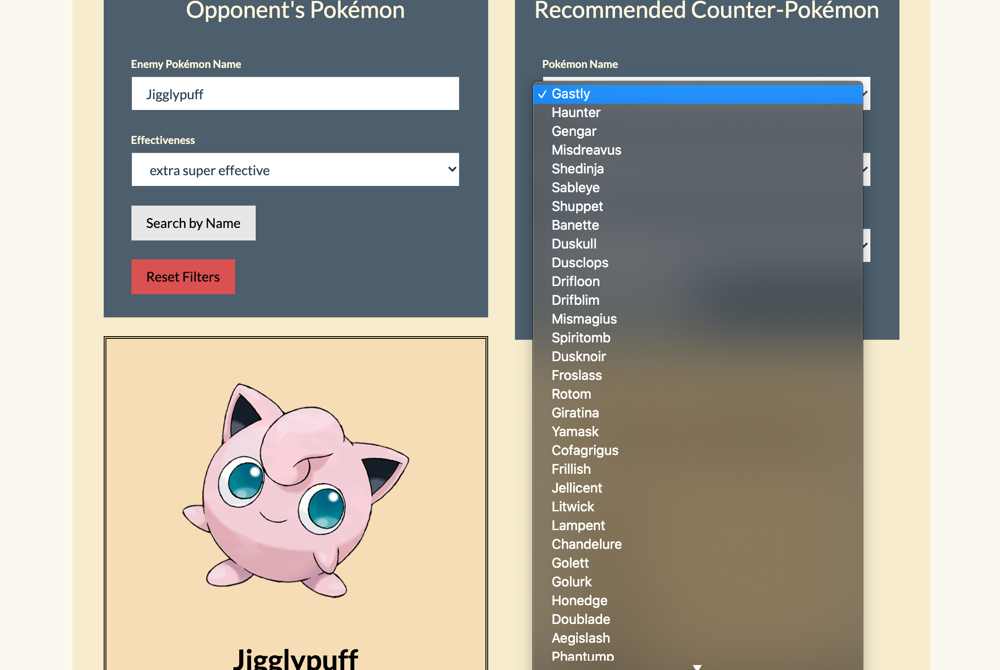

# pokemon_project

For this project, we were required to source some data and create a Flask app web server to serve the data from a database backend to users viewing an interactive website with JavaScript processing the data. We chose to use pokemon data.

We used:
- Data sources: 
	* https://www.kaggle.com/rounakbanik/pokemon
	* Web scraping entries: https://pokemondb.net/pokedex/
	* Image scraping entries: https://www.pokemon.com/us/pokedex/
- Database: MongoDB
- Python Flask Web Server
- JavaScript frontend with D3.js for filtering forms and the graph

To replicate the MongoDB, first clone this repo and run [data/load_data.ipynb](data/load_data.ipynb). There are two csv files in [data/csv](data/csv) that essentially replicate the structure of our two collections. We separated the pokemon data into basic information and battle information. The battle information is only relevant for our fight page.

## Website

We created 4 different interactive pages for the website, all of which are referenced in the navbar, which you can see above. 
* Home
* Fight
* Breed
* Graph

### Home

### Fight

### Breed

The purpose of this page is to allow users to search by pokemon name (generation 1 only; the Flask app only serves generation 1 data to this page) on two different pokemon, and display pokemon cards for those pokemon. Then, if you click the "Breed" button, it will redirect you to the relevant fusion page on https://pokemon.alexonsager.net/ for the selected pokemon.

**Pokemon breed page example**

**Referral Page**

### Graph

The graph page serves all 801 pokemon in the database and was built with D3.js. It can be filtered by pokemon type, generation, and max and min height and weight. It allows you to interact with different options on the x and y axis, plotting data on height, weight, speed, and HP. The circles are coloured by pokemon type (whatever is listed as their first type), and there is a tool tip with relevant data about each pokemon when you mouseover the circles.

**Sample graph**

**Filter settings for above graph**

**Sample Tool Tip with different filter options**

